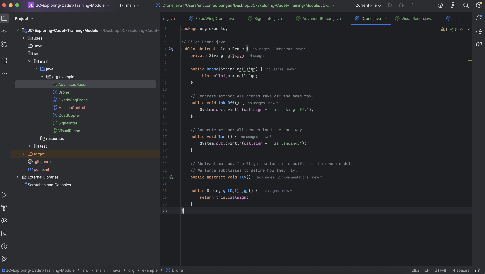
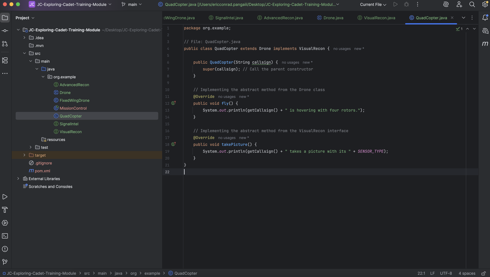

# FECP5-1009: Java Certification Preparation

## Cadet Training Module: Java Inheritance and Interfaces
## Eric Conrad Panga
## Screenshots of Output

Drone Class

Visual Recon Interface

QuadCopter Class

Signal Intel and Advanced Recon Interfaces

Fixed Wing Drone Class

Mission Control / Main Class

